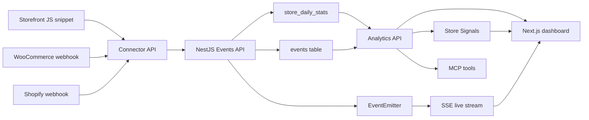

# Cartograph

Open-source real-time ecommerce analytics for custom storefronts, WooCommerce-style stores, and small teams that need a fast live view without living inside GA4.

Cartograph ingests store events, writes raw history, maintains daily aggregate stats, and renders a merchant-friendly dashboard with revenue, conversion, top products, and live activity. It is built as a proof-of-work project, but the architecture is intentionally close to a real product.

[Video walkthrough](https://youtu.be/ZPBcP68M4h8)

## What It Solves

Small ecommerce teams often know orders are happening, but they do not have a simple answer to "what is happening in my store right now?"

Common pain:

- GA4 ecommerce setup requires event names, parameters, GTM wiring, debug mode, and delayed reports.
- Native ecommerce dashboards are useful, but often stop at summary cards and periodic refresh.
- WooCommerce reporting can become slow when reports run against the live WordPress database.
- Agencies and custom storefront builders keep rebuilding the same analytics layer for clients.

Cartograph focuses on a narrower wedge: a self-hostable, developer-friendly live store pulse that stays fast as event volume grows.

## Current Product

- Store-scoped login with JWT demo auth.
- Event ingestion for `page_view`, `add_to_cart`, `remove_from_cart`, `checkout_started`, and `purchase`.
- Store-scoped connector ingest keys for browser snippets and ecommerce webhooks.
- Public JS tracking snippet for custom storefronts.
- WooCommerce order webhook adapter.
- Shopify order webhook adapter.
- Raw `events` table for source-of-truth history.
- Write-time daily aggregation into `store_daily_stats`.
- Dashboard cards for today's revenue, week/month revenue, conversion, and live visitors.
- Merchant-friendly Store Signals for live sales, checkout stalls, revenue drops, and product movement.
- Revenue, event-type, top-product, and recent-activity views.
- Server-Sent Events live feed.
- MCP server exposing analytics as AI-callable tools.
- Scale proof script for a 2M-event dataset.

## Architecture


```mermaid
flowchart LR
  Storefront["Storefront JS snippet"] --> Connectors["Connector API"]
  Woo["WooCommerce webhook"] --> Connectors
  Shopify["Shopify webhook"] --> Connectors
  Connectors --> API["NestJS Events API"]
  API --> Raw["events table"]
  API --> Stats["store_daily_stats"]
  API --> Bus["EventEmitter"]
  Stats --> Analytics["Analytics API"]
  Raw --> Analytics
  Analytics --> Alerts["Store Signals"]
  Analytics --> Dashboard["Next.js dashboard"]
  Alerts --> Dashboard
  Bus --> SSE["SSE live stream"]
  SSE --> Dashboard
  Analytics --> MCP["MCP tools"]
```

The main dashboard overview reads from `store_daily_stats`, not the raw event log. For a 90-day range and five event types, the backend reads at most hundreds of aggregate rows per store instead of scanning millions of events.

## Stack

- Backend: NestJS, TypeScript, Prisma, PostgreSQL, JWT auth, SSE.
- Frontend: Next.js App Router, React Query, Recharts, Tailwind CSS.
- AI access: Model Context Protocol server over stdio.

## Quick Start

You need Node 18+ and PostgreSQL.

### Backend

```bash
cd backend
npm install
cp .env.example .env
npx prisma migrate dev
npx prisma db seed
npm run start:dev
```

Backend runs on `http://localhost:3001`.

### Frontend

```bash
cd frontend
npm install
cp .env.example .env.local
npm run dev
```

Frontend runs on `http://localhost:3000`.

### Login

Open `http://localhost:3000/login`, enter a seeded store such as `store_alpha`, and generate a demo token.

### Docker Demo

```bash
docker compose up --build
```

Then open `http://localhost:3000`. See [demo runbook](docs/DEMO_RUNBOOK.md) for seeding and live-event replay.

### Live Event Replay

From `backend`:

```bash
npm run demo:live
```

Use `API_URL=https://your-backend-domain npm run demo:live` against a hosted backend.

## API Shape

Create an event:

```bash
curl -X POST "http://localhost:3001/api/v1/events" \
  -H "Authorization: Bearer YOUR_TOKEN" \
  -H "Content-Type: application/json" \
  -d '{
    "event_id": "evt_demo_001",
    "store_id": "store_alpha",
    "event_type": "purchase",
    "timestamp": "2026-03-28T13:00:00Z",
    "data": {
      "product_id": "prod_012",
      "amount": 249.99,
      "currency": "USD"
    }
  }'
```

Analytics endpoints:

- `GET /api/v1/analytics/overview`
- `GET /api/v1/analytics/top-products`
- `GET /api/v1/analytics/recent-activity`
- `GET /api/v1/analytics/live-visitors`
- `GET /api/v1/analytics/alerts`
- `GET /api/v1/analytics/live?token=...`

## Connectors

Mint a scoped ingest key for the authenticated store:

```bash
curl "http://localhost:3001/api/v1/connectors/ingest-key" \
  -H "Authorization: Bearer YOUR_TOKEN"
```

Custom storefronts can use the returned script tag, or post directly:

```bash
curl -X POST "http://localhost:3001/api/v1/connectors/track" \
  -H "Content-Type: application/json" \
  -d '{
    "store_id": "store_alpha",
    "ingest_key": "YOUR_SCOPED_INGEST_KEY",
    "event_type": "add_to_cart",
    "timestamp": "2026-03-28T13:00:00Z",
    "data": {
      "product_id": "prod_012"
    }
  }'
```

WooCommerce and Shopify order webhooks post to:

- `POST /api/v1/connectors/woocommerce/orders`
- `POST /api/v1/connectors/shopify/orders`

Include these headers:

```text
x-cartograph-store-id: store_alpha
x-cartograph-ingest-key: YOUR_SCOPED_INGEST_KEY
```

WooCommerce `processing` and `completed` orders map to purchase events. Shopify `paid`, `partially_paid`, and `partially_refunded` orders map to purchase events. Pending/authorized order states map to checkout-started events.

For browser snippet installs, include the storefront origin in `CORS_ORIGINS`, for example `https://your-dashboard.vercel.app,https://your-store.com`.

## MCP Tools

From `backend`:

```bash
npm run mcp:start
```

Available tools:

- `mint_store_token`
- `get_overview`
- `get_top_products`
- `get_recent_activity`
- `get_live_visitors`
- `get_dashboard_snapshot`
- `verify_store_isolation`

## Proof Points

Local verification commands:

```bash
cd backend
npm audit --audit-level=moderate
npm run build
npm test -- --runInBand
npm run test:e2e -- --runInBand
node --check scripts/live-demo.js

cd ../frontend
npm audit --audit-level=moderate
npm run build
npm run lint
```

The repo also includes `backend/scripts/scale-proof.js`, which creates a 2M-event scale dataset for `store_scale`, measures the key API endpoints, and writes `backend/SCALE_PROOF.md`.

## Market Launch Kit

The repo includes practical launch docs:

- [Final project plan](docs/FINAL_PROJECT_PLAN.md)
- [Market scout](docs/MARKET_SCOUT.md)
- [Deployment guide](docs/DEPLOYMENT.md)
- [Demo runbook](docs/DEMO_RUNBOOK.md)
- [Architecture notes](docs/ARCHITECTURE.md)
- [Connector roadmap](docs/CONNECTOR_ROADMAP.md)
- [Launch checklist](docs/LAUNCH_CHECKLIST.md)
- [Outreach kit](docs/OUTREACH.md)
- [Proof-of-work checklist](docs/PROOF_OF_WORK.md)

## Repository Docs

- [Contributing](CONTRIBUTING.md)
- [Security policy](SECURITY.md)
- [Code of conduct](CODE_OF_CONDUCT.md)
- [Changelog](CHANGELOG.md)

## Known Limitations

- Auth is demo-only. Any store ID can mint a token.
- Browser `EventSource` cannot send headers, so SSE accepts the JWT through `?token=...`. Production should use a short-lived stream token.
- Live visitors are estimated from recent page views until session/user identifiers are added.
- SSE uses an in-process event bus. Multi-instance production deployments should use Redis Pub/Sub or a broker.
- Tenant isolation is enforced in application code. PostgreSQL Row Level Security would make this stronger.
- Connector ingest keys are deterministic HMAC keys for the proof-of-concept. Production should store hashed, revocable keys.

## Roadmap

1. Add hashed, revocable connector keys and rate limiting.
2. Add packaged WooCommerce and Shopify install helpers.
3. Add session/customer identifiers for stronger live visitor counts.
4. Add PostgreSQL RLS and short-lived SSE stream tokens.
5. Host a public demo and collect feedback from ecommerce agencies.

## License

MIT.
