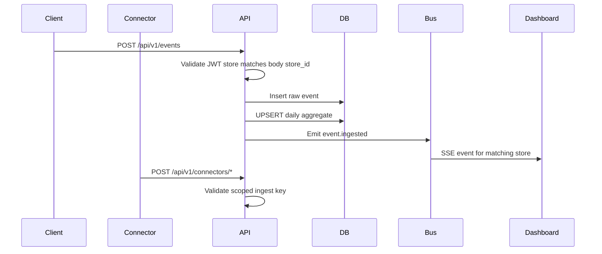

# Architecture Notes

## System Summary

Cartograph is a real-time analytics system for ecommerce events.

It has four core paths:

1. Event ingestion.
2. Write-time aggregation.
3. Store-scoped analytics reads.
4. Connector ingestion.
5. Merchant alert signals.
6. Live activity streaming.

## Data Model

### `events`

Raw source-of-truth event log.

Stores:

- event ID
- store ID
- event type
- timestamp
- product ID
- amount
- currency

Indexes:

- `[storeId, timestamp]`
- `[storeId, eventType, timestamp]`

Used by:

- recent activity
- top products
- live visitor snapshot

### `store_daily_stats`

Pre-aggregated daily stats.

One row per:

```text
store_id + date + event_type
```

Used by:

- revenue cards
- conversion rate
- event breakdown
- revenue over time

## Why Write-Time Aggregation?

The dashboard overview should not scan raw events every time the merchant opens the page.

Instead, every event write also updates a small daily aggregate row. This creates write amplification, but read latency stays predictable as the event table grows.

For a 90-day range with five event types, the overview reads at most:

```text
90 days * 5 event types = 450 rows per store
```

That is the core performance proof.

## Event Ingestion Flow



The write path runs inside a Prisma transaction. If the raw event write fails, the aggregate update does not commit. If the aggregate update fails, the raw event does not commit.

## Tenant Isolation

Reads use `req.user.storeId` from the JWT.

Writes also require the authenticated store to match the event payload `store_id`. This prevents a token for one store from inserting events into another store's analytics.

Production hardening:

- real user auth
- hashed, revocable scoped ingest keys
- PostgreSQL Row Level Security
- audit logs for API access

## Connector Layer

The connector layer normalizes public store data into the same `CreateEventDto` shape used by the authenticated event API.

Implemented connectors:

- `GET /api/v1/connectors/ingest-key`: returns the store-scoped HMAC ingest key, tracking snippet, endpoint URLs, and webhook headers for the authenticated store.
- `GET /api/v1/connectors/snippet.js`: serves the browser snippet for custom storefronts.
- `POST /api/v1/connectors/track`: accepts public browser events with a scoped ingest key.
- `POST /api/v1/connectors/woocommerce/orders`: maps WooCommerce order payloads to `purchase` or `checkout_started`.
- `POST /api/v1/connectors/shopify/orders`: maps Shopify order payloads to `purchase` or `checkout_started`.

Connector security:

- the key is scoped to one store ID
- connector writes never read analytics
- duplicate event IDs are treated as idempotent skips
- production should add hashed key storage, revocation, rate limiting, and native webhook signature verification

## Store Signals

`GET /api/v1/analytics/alerts` computes merchant-friendly signals from recent events and daily stats.

Current rules:

- high visitors with zero carts
- checkout started but no purchases
- revenue dropped vs yesterday
- top product changed today
- live sale happened

These are computed on read rather than persisted. That keeps the proof-of-concept simple and gives the dashboard useful operational language without adding another table yet.

## Real-Time Layer

The backend uses Server-Sent Events because the dashboard only receives updates from the server. The client does not need bidirectional socket messages.

Current implementation:

- NestJS `@Sse()`
- in-process `EventEmitter2`
- frontend `EventSource`
- JWT accepted as query param because native `EventSource` cannot send custom headers

Production hardening:

- short-lived stream tokens
- Redis Pub/Sub or a message broker for multiple backend instances
- heartbeat messages

## Frontend Data Strategy

The frontend intentionally separates snapshot data and live patch data.

Snapshot:

- React Query fetches overview, top products, recent activity, and live visitor summary.
- Aggregates refresh in the background.

Live patch:

- `useLiveFeed` opens an SSE connection.
- New events are prepended into local state.
- The rendered feed merges live events with the initial recent activity response.

This prevents React Query background fetches from overwriting live streamed events.

## MCP Layer

The MCP server wraps existing analytics endpoints as tools:

- overview
- top products
- recent activity
- live visitors
- dashboard snapshot
- store isolation verification

This makes Cartograph useful as an AI-agent data surface, not only a human dashboard.

## Scaling Path

Near-term:

- keep write-time aggregation
- add rate limiting

Mid-term:

- add Redis Pub/Sub for streams
- add hashed, revocable scoped ingest keys
- add PostgreSQL RLS

Long-term:

- TimescaleDB continuous aggregates
- persisted alert history and notification channels
- customer/session tracking
- warehouse export
